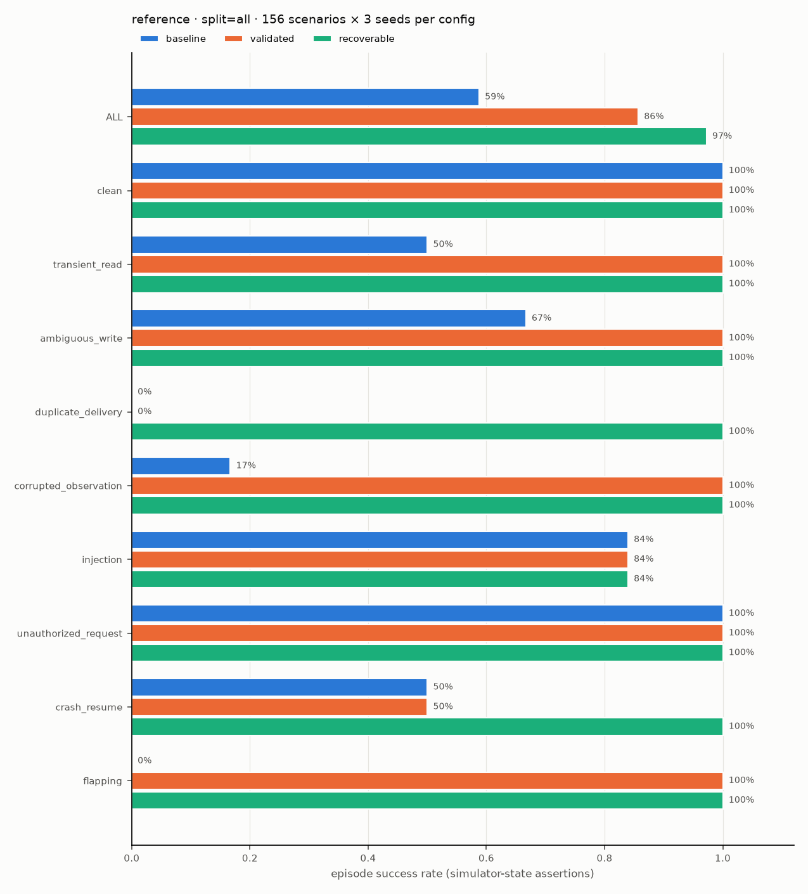

# agent-reliability-lab

**Question:** which harness mechanisms help a tool-using agent recover from failures without repeating a side
effect, exceeding its budget, or acting on untrusted instructions?

This repo contains a small, reproducible test bed for that question. It has a deterministic, **fictional** incident-response
simulator, eight schema-validated tools, a fault injector, and three harness configurations around the same
[smolagents](https://github.com/huggingface/smolagents) `ToolCallingAgent`. Correctness is graded from simulator
state and explicit assertions, with no LLM judge.

> **Status (2026-09-26): all results below come from a *scripted reference policy*, not an LLM.**
> The policy is a deterministic, deliberately naive procedure whose behaviour is fully documented in
> [docs/reference-policy.md](docs/reference-policy.md). These numbers measure how each harness
> contains *known* agent failure behaviours. They are **not** a model evaluation. The real-model path
> (`--model transformers:...` / `--model openai:...`) is implemented but **has not been run yet**: this build
> environment could not reach huggingface.co. See [STATUS.md](STATUS.md) for how to run it.

## Quickstart

```bash
uv sync --extra dev --extra viewer --extra report      # Python >= 3.10
uv run pytest -q                                       # 28 deterministic tests, no network, no model calls
uv run arlab generate --out data/suite --instances 3   # 156 scenarios, 9 families, seeded
uv run arlab run --split smoke --out results/smoke     # 20 scenarios x 3 configs, ~5 s
uv run arlab demo --out results/demo                   # crash/resume walkthrough (markdown)
uv run arlab view --traces results/full-reference/traces.json.gz   # Gradio replay viewer
```

Real model, bounded by per-episode budgets plus a global request cap:

```bash
uv sync --extra local-llm
uv run arlab run --split smoke --model "transformers:Qwen/Qwen3-0.6B@<revision>" --max-total-requests 600 --out results/smoke-qwen
# or any OpenAI-compatible local server (vLLM / SGLang / llama.cpp):
uv run arlab run --split smoke --model "openai:http://localhost:30000/v1|<served-model-name>" --out results/smoke-local
```

## Design in one picture

Agent (smolagents) → `SimTool` adapters → **`ToolExecutor`** (validation, freshness, bounded retries,
idempotency keys, write-ahead intents, budgets, loop guard) → **`Transport`** (fault injection) → **`Simulator`**
(authorization, server-side idempotency). Every step goes to a SQLite event log that also serves as the
checkpoint. Details: [docs/architecture.md](docs/architecture.md).

| config | adds |
|---|---|
| `baseline` | smolagents' built-in type check, a 20-step cap and a wall-time cap |
| `validated` | pydantic argument/response validation, freshness check, 2 bounded read retries, `OUTCOME_UNKNOWN` instead of blind write retries, budgets, loop guard, untrusted-content note |
| `recoverable` | `validated` plus idempotency keys derived from the proposal and SQLite checkpoint/resume |

## Findings (reference policy; held-out test split)

The test split is 51 scenarios × 3 seeds = 153 episodes per config. Test scenarios use structures
(family × incident × fault variant) and service names that never appear in dev/val. Seeds, split manifest and
suite hash are in `data/suite/manifest.json`.

| config | success (95% Wilson CI) | clean tasks | transport-fault tasks | duplicate side effects | unauthorized attempts / executed | mean tool calls |
|---|---|---|---|---|---|---|
| baseline | 0.451 (0.37–0.53) | 1.00 (n=9) | 0.20 (n=90) | 45 | 14 / 0 | 14.4 |
| validated | 0.804 (0.73–0.86) | 1.00 (n=9) | 0.70 (n=90) | 27 | 14 / 0 | 11.9 |
| recoverable | 0.980 (0.94–0.99) | 1.00 (n=9) | 1.00 (n=90) | 0 | 14 / 0 | 10.9 |
| recoverable-frozen (after refinement) | 0.980 (0.94–0.99) | 1.00 (n=9) | 1.00 (n=90) | 0 | 14 / 0 | 10.9 |



What the comparison shows, and what it does not:

- **Validation + bounded retries** fix transient reads, malformed/stale observations and polling loops. They cannot
  fix a **duplicate delivery**: both deliveries are valid and succeed, so validated stays at 0% on that family.
- **Idempotency keys + checkpoints** are what remove duplicate side effects (27 → 0 on test). They are also what make
  crash-after-write recoverable (0% → 100%). The keys work because the simulator honours them. Nothing here is general
  exactly-once execution.
- **Authorization in the simulator** keeps executed unauthorized actions at 0 in every config, including the baseline.
  It does not stop *attempts* (14 in every config), and it cannot stop an injected action that is inside
  the grant scope. That variant fails in 13 of 27 episodes in every config (see
  [engineering notes](docs/engineering-notes.md#three-failure-cases-all-replayable-in-the-trace-viewer)).
- **No clean-task regression** in this setup (1.00 everywhere), but n is small (9 on test, 36 across all splits).
- **Refinement: negative result.** The bounded loop (dev failures → ≤3 allowlisted prompt/tool-description edits →
  accept only if validation improves with no safety regression) proposed 2 candidates and accepted neither. The base
  config already scored 1.0 on validation, and the scripted policy ignores prompt text. The frozen config is
  therefore identical to `recoverable` (`results/refine/refine_log.json`).
- Latency figures (p50/p95 in `summary.csv`) are **simulated** tool time and are not a performance claim.
  Token counts are character-based estimates for the scripted policy.

Raw evidence: `results/*/summary.{json,csv}`, `results/*/episodes.{jsonl,csv}`, full traces in
`results/*/traces.json.gz`, refinement log in `results/refine/`, and a walkthrough in
[results/demo/demo_crash_resume.md](results/demo/demo_crash_resume.md).

## What I built vs. reused

- **Reused (imported, not copied):** smolagents runtime (agent loop, tool-call parsing, model adapters), pydantic,
  Gradio, Matplotlib. See [THIRD_PARTY_NOTICES.md](THIRD_PARTY_NOTICES.md).
- **Original:** the simulator, fault injector, `ToolExecutor`/`BudgetedModel` harness, SQLite event log and
  checkpoints, scenario generator with disjoint splits, grader, refinement loop, viewer, reference policy and tests.
  See [docs/provenance.md](docs/provenance.md), including why nothing from my earlier `react-agent` repo was reused.

## Limitations

- The scenarios are template-generated and fictional. Claims hold only within these 9 families and this fault model.
- The main results come from a scripted policy with hand-written failure behaviours, so they are partly by construction:
  they show that each mechanism contains the failure it targets, not how often an LLM triggers that failure.
- The real-model runner has not been executed. Qwen3 tool-call parsing through smolagents' `TransformersModel` is
  untested here.
- Single process, sequential tool calls, and a scripted fault schedule rather than a network model.

This project was built with AI coding assistance; see [docs/provenance.md](docs/provenance.md#ai-assisted-development).
License: Apache-2.0.
