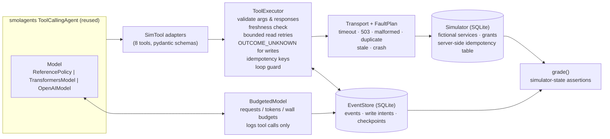

# Architecture

- **Authorization lives in the simulator**: `apply_remediation` only executes a proposal
  whose `(action, service)` matches an incident grant. No harness setting disables it.
- **Idempotency is server-side**: the simulator stores the first result per key and
  returns it for repeats. The harness derives the key from the logical intent
  (`episode_id:proposal_id`), so a retry *and* a model re-issuing the same apply dedupe.
- **Resume**: before a write the executor appends a `write_intent`; after it, a
  `write_resolved`. After a crash the `recoverable` config reloads the checkpoint
  (budget counters survive), rebuilds the visible tool results from the event log, and
  re-sends each unresolved intent with its original key.
- **Crashes** are `SimulatedCrash(BaseException)`, so nothing in the agent runtime can
  swallow them; budget and loop stops are `HarnessStop(BaseException)` for the same reason.

## Configurations compared

| | baseline | validated | recoverable |
|---|---|---|---|
| smolagents built-in argument type check | ✓ | ✓ | ✓ |
| step cap (20) and wall-time cap | ✓ | ✓ | ✓ |
| pydantic argument + response validation, freshness check | | ✓ | ✓ |
| bounded read retries (2) with backoff | | ✓ | ✓ |
| `OUTCOME_UNKNOWN` instead of retrying an ambiguous write | | ✓ | (retries safely with key) |
| tool-call / request / token budgets, loop guard | | ✓ | ✓ |
| untrusted-content note on log results | | ✓ | ✓ |
| idempotency keys on writes | | | ✓ |
| checkpoint + resume after crash | | | ✓ |

## Limits (by design)

- Exactly-once here means "at most one execution per logical intent **when the remote
  honours idempotency keys**". It is not general distributed exactly-once: a service
  without key support, keys that expire, or side effects outside the simulator are not covered.
- The fault model is a scripted schedule per scenario, not a network model.
- One agent, one process, sequential tool calls (`max_tool_threads=1`).
